[](https://colab.research.google.com/github/saliton/CrosshairLabel/blob/main/CrosshairLabel.ipynb)

# Bokehの図にマウスポインタの位置の値を表示する拡張機能を付加する方法

[以前の記事(Google Colabでグリグリ動くローソク足をBokehで生成してみた)](https://qiita.com/saliton/items/6249d92f266ef435a5f0)でインタラクティブなローソク足をBokehで作成しました。その際、値を吹き出しで表示する機能は邪魔なので除いてしまいました。しかし、十字線が表示されるとはいえ、目視で値を読み取るのはちょっと苦労します。そこでよくあるのは十字線に連動してその値を表示するGUIですが、この機能はBokehには標準機能として用意されていません。本記事ではBokehの機能拡張を利用してこれを実現します。

まずはデータを取得します。


```Python
import pandas_datareader.data as web
df = web.DataReader("3040.JP", "stooq").dropna().sort_index()
```

次に、ローソク足を作成する関数を定義します。


```Python
from bokeh.plotting import figure
from bokeh.models import ColumnDataSource
import pandas as pd

def candlestick(df, plot_width=600, plot_height=300):
    df = df.reset_index()
    source = ColumnDataSource(df)
    inc = ColumnDataSource(df[df.Close >= df.Open])
    dec = ColumnDataSource(df[df.Open > df.Close])
    w = (df.index[1] - df.index[0]) / 2  # X軸の1メモリの半分

    fig = figure(plot_width=plot_width, plot_height=plot_height)
    fig.segment('index', 'High', 'index', 'Low', source=source, color="black")
    fig.vbar('index', w, 'Open', 'Close', source=inc, line_color="black", fill_color="white")
    fig.vbar('index', w, 'Open', 'Close', source=dec, line_color="black", fill_color="black")
    fig.xaxis.major_label_overrides = {
        i: pd.to_datetime(date).strftime('%Y-%m-%d') for i, date in enumerate(source.data['Date'])
    }
    fig.xaxis.bounds = (0, df.index[-1]) # X軸の範囲を明示的に指定
    fig.outline_line_color = 'black'
    return fig

```

ローソク足の描画は以下になります。


```Python
from bokeh.plotting import show, output_notebook
from bokeh.models import CrosshairTool

fig = candlestick(df['2020-8-1':])
fig.add_tools(CrosshairTool())
output_notebook()  # 出力先をノートブックに設定
show(fig)
```


BokehではイベントにJavaScriptのコードを結び付けることができ、これを利用して機能を拡張します。イベントにコードを結びつける例は[ここ](https://docs.bokeh.org/en/latest/docs/user_guide/interaction/callbacks.html)にあります。この例を参考に図中のマウスポインターの位置を取得して表示させているのが以下です。


```Python
from bokeh.models import CustomJS, Div
from bokeh import events
from bokeh.layouts import row

div = Div(width=400, height=fig.plot_height, height_policy="fixed")

def display_event(div, attributes=[], style = 'float:left;clear:left;font_size=13px'):
    "Build a suitable CustomJS to display the current event in the div model."
    return CustomJS(args=dict(div=div), code="""
        var attrs = %s; var args = [];
        for (var i = 0; i<attrs.length; i++) {
            args.push(attrs[i] + '=' + Number(cb_obj[attrs[i]]).toFixed(2));
        }
        var line = "<span style=%r><b>" + cb_obj.event_name + "</b>(" + args.join(", ") + ")</span>\\n";
        var text = div.text.concat(line);
        var lines = text.split("\\n")
        if (lines.length > 35)
            lines.shift();
        div.text = lines.join("\\n");
    """ % (attributes, style))

point_attributes = ['x', 'y', 'sx', 'sy'] 
fig.js_on_event(events.MouseMove, display_event(div, attributes=point_attributes))

output_notebook()  # 出力先をノートブックに設定
show(row(fig, div))
```

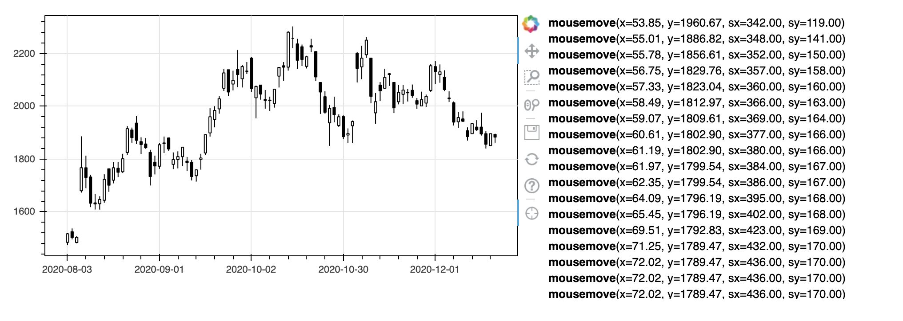

Pythonの世界からJavaScriptを呼んじゃってます。Bokeh恐るべしです。

上記を見るとJavaScriptにx, y, sx, syという値が渡せることが分かります。x, yは各座標軸上の座標、sx, syは左上を原点としたスクリーン上の座標のようです。これを利用して、十字線の中心座標を画面上に動的に表示させましょう。

基本的な戦略は、Pythonの世界で作成して追加したGUIの部品をJavaScriptの世界に持ち込んで、操作するというものです。以下のようにLabelの部品を追加します。


```Python
from bokeh.models.annotations import Label
fig = candlestick(df['2020-8-1':])
label = Label(text="Label", x=1, y=2000, background_fill_color='yellow')
fig.add_layout(label)
output_notebook()
show(fig)
```

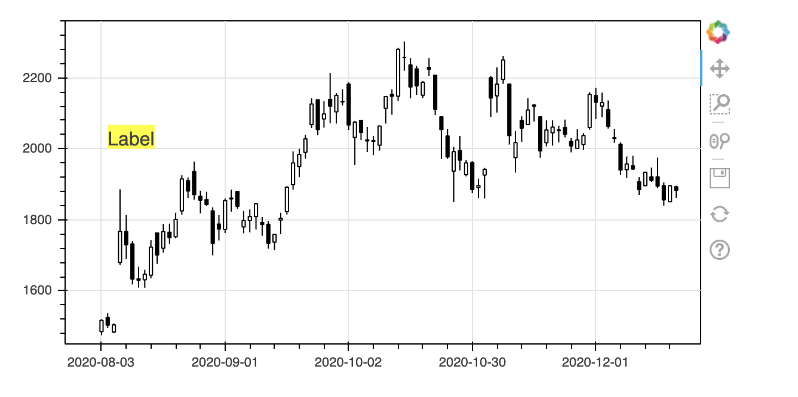

JavaScriptの世界には引数を介して持ち込みます。CustomJSのcodeの中ではcb_objという変数があって、 ```{origin:f, sx:550, sy:60, x:62.34, y:2109.90}```という形をしています。そこで、ラベルの表示にy軸の座標を整数化したものを表示するには以下のようにします。


```Python
def display_event(label):
    return CustomJS(args=dict(label=label), code="""
        label.text = Number(cb_obj['y']).toFixed(0)
    """)

fig = candlestick(df['2020-8-1':])
label = Label(text="Label", x=1, y=2000, background_fill_color='yellow')
fig.add_layout(label)
fig.add_tools(CrosshairTool())
fig.js_on_event(events.MouseMove, display_event(label=label))
output_notebook()
show(fig)
```

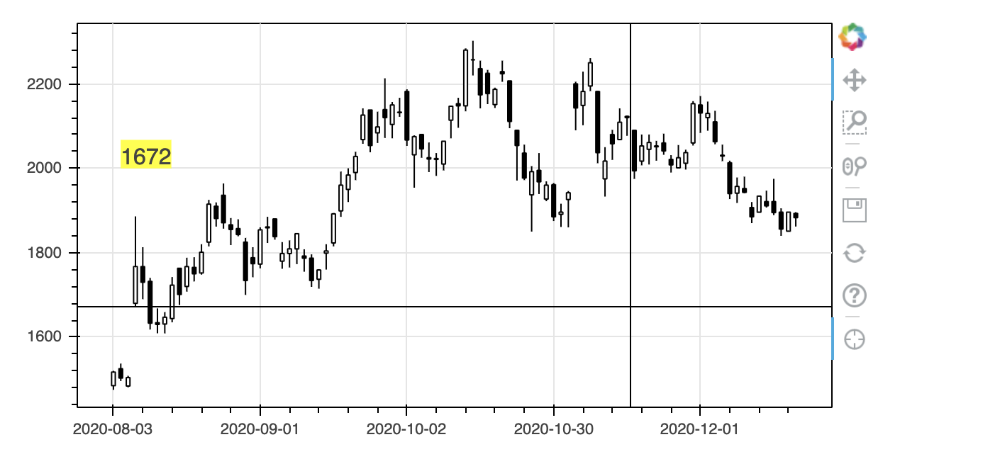

マウスポインターの動きに追従してy軸の値がラベルの中に表示されますね。ラベルにはx,yという属性があって表示位置を指定できるので、マウスポインターの位置にラベルが表示されるようにするには以下のようにします。


```Python
def display_event(label):
    return CustomJS(args=dict(label=label), code="""
        label.text = Number(cb_obj['y']).toFixed(0)
        label.x = cb_obj['x']
        label.y = cb_obj['y']
    """)

fig = candlestick(df['2020-8-1':])
label = Label(background_fill_color='yellow')
fig.add_layout(label)
fig.add_tools(CrosshairTool())
fig.js_on_event(events.MouseMove, display_event(label=label))
output_notebook()
show(fig)
```

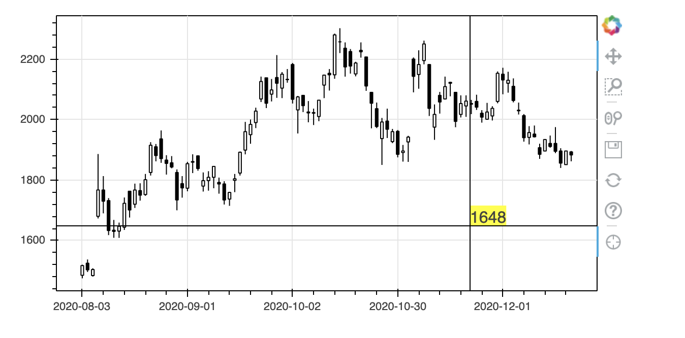

うまくいきました。それではここでラベルの表示位置をy軸のそばにするため、label.xを0にしてみます。


```Python
def display_event(label):
    return CustomJS(args=dict(label=label), code="""
        label.text = Number(cb_obj['y']).toFixed(0)
        label.x = 0
        label.y = cb_obj['y']
    """)

fig = candlestick(df['2020-8-1':])
label = Label(background_fill_color='yellow')
fig.add_layout(label)
fig.add_tools(CrosshairTool())
fig.js_on_event(events.MouseMove, display_event(label=label))
output_notebook()
show(fig)
```

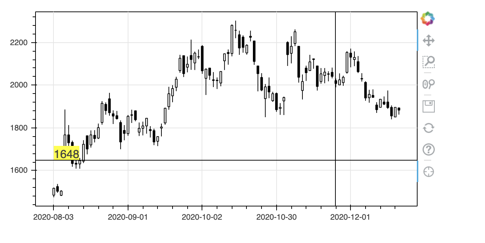

一見、うまくいっているように見えます。しかし、図をドラッグして左右に動かすとダメなことがわかります。図の左端ではなく、先頭のデータの位置に表示されています。これはlabel.xがスクリーン座標ではなくデータ位置だからです。

Labelの定義でx_units='screen'を指定すればこれを回避できます。具体的には以下のようにします。


```Python
def display_event(label):
    return CustomJS(args=dict(label=label), code="""
        label.text = Number(cb_obj['y']).toFixed(0)
        label.x = 0
        label.y = cb_obj['y']
    """)

fig = candlestick(df['2020-8-1':])
label = Label(background_fill_color='yellow', x_units='screen')
fig.add_layout(label)
fig.add_tools(CrosshairTool())
fig.js_on_event(events.MouseMove, display_event(label=label))
output_notebook()
show(fig)
```

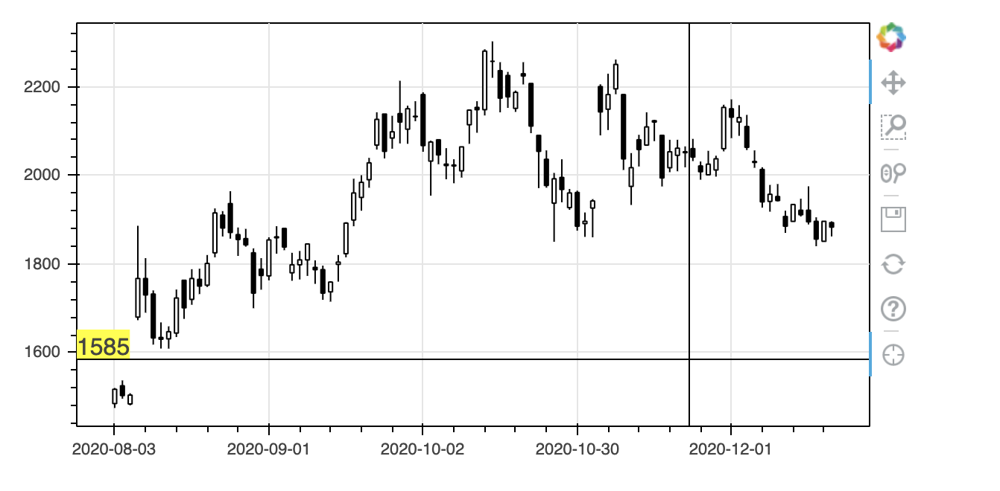

Labelには色々とオプションがあるので、見え方を調整してみます。その際、図表の外側に表示するためにはrender_modeを'css'にする必要があります。


```Python
def display_event(label):
    return CustomJS(args=dict(label=label), code="""
        label.text = Number(cb_obj['y']).toFixed(0)
        label.x = 0
        label.y = cb_obj['y']
    """)

fig = candlestick(df['2020-8-1':])
label = Label(x_units='screen', x_offset=-40, y_offset=-8, render_mode='css',
              border_line_color='black', background_fill_color='white')
fig.add_layout(label)
fig.add_tools(CrosshairTool())
fig.js_on_event(events.MouseMove, display_event(label=label))
output_notebook()
show(fig)
```

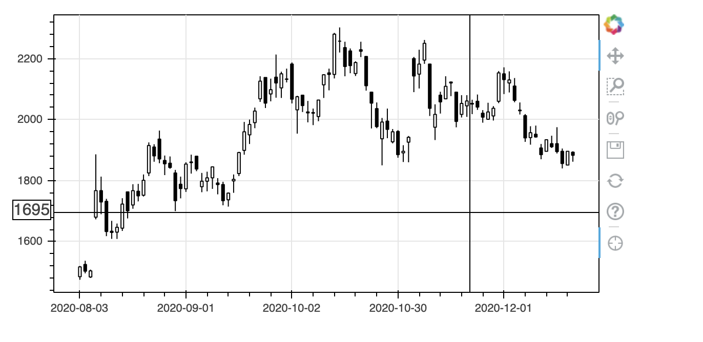

それでは今度は日付を表示するようにしてみましょう。


```Python
def display_event(label):
    return CustomJS(args=dict(label=label), code="""
        label.text = String(cb_obj['x'])
        label.x = cb_obj['x']
        label.y = cb_obj['y']
    """)

fig = candlestick(df['2020-8-1':])
label = Label(background_fill_color='yellow')
fig.add_layout(label)
fig.add_tools(CrosshairTool())
fig.js_on_event(events.MouseMove, display_event(label=label))
output_notebook()
show(fig)
```

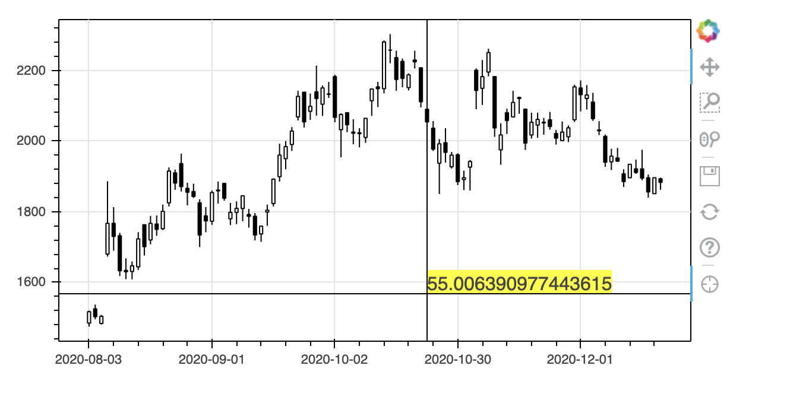

失敗です。x軸は土日を詰めるために日付そのものではなくデータ位置になっているのでした。データ位置と日付の対応をとるためには元データを渡す必要がありますが、うまくいくのでしょうか。


```Python
def display_event(source, label):
    return CustomJS(args=dict(source=source, label=label), code="""
        var date = new Date(source.data['Date'][Number(cb_obj['x']).toFixed(0)])
        label.text = date.toISOString().substr(0, 10)
        label.x = cb_obj['x']
        label.y = cb_obj['y']
    """)

target = df['2020-8-1':]
fig = candlestick(target)
label = Label(background_fill_color='yellow')
fig.add_layout(label)
fig.add_tools(CrosshairTool())
fig.js_on_event(events.MouseMove, display_event(source=ColumnDataSource(target), label=label))
output_notebook()
show(fig)
```

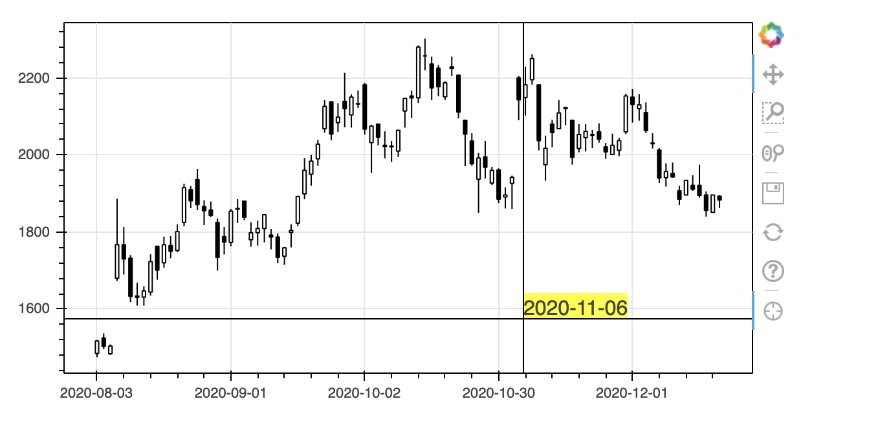

簡単にできてしまいました。Bokeh恐るべし。実はdisplay_eventのsourceに最初は
targetそのものを指定したのですが、JSONに変換できないというエラーになりました。
```
TypeError: Object of type 'DataFrame' is not JSON serializable
```
逆に、JSON serializableなものなら渡せるということです。よくできてますね。

実は、まだ一つ不満があります。図をドラッグさせてデータがない部分にマウスカーソルを動かすと、ラベルが張り付いて動かなくなるのです。どうやら日付を抽出するコードで範囲エラーが起こっているようです。エラーが起こったらラベルを消すようにしてみましょう。


```Python
def display_event(source, label):
    return CustomJS(args=dict(source=source, label=label), code="""
        try {
            label.visible = true
            var date = new Date(source.data['Date'][Number(cb_obj['x']).toFixed(0)])
            label.text = date.toISOString().substr(0, 10)
            label.x = cb_obj['x']
            label.y = cb_obj['y']
        } catch(e) {
            label.visible = false
        }
    """)

target = df['2020-8-1':]
fig = candlestick(target)
label = Label(background_fill_color='yellow')
fig.add_layout(label)
fig.add_tools(CrosshairTool())
fig.js_on_event(events.MouseMove, display_event(source=ColumnDataSource(target), label=label))
output_notebook()
show(fig)
```

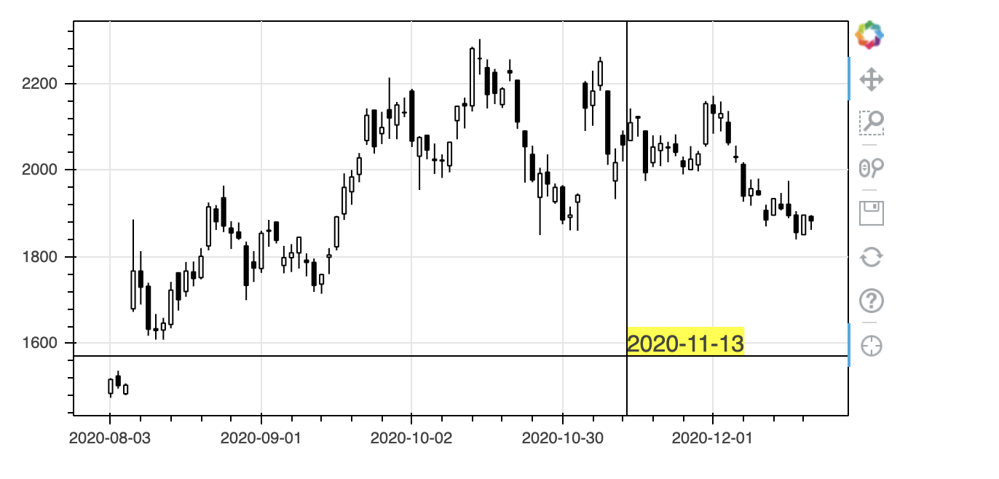

範囲外でうまくラベルが消えるようになりました。

以上を合わせてx軸とy軸を両方とも表示するには以下になります。ついでにマウスカーソルが図から外れた時にラベルが残らないようにevents.MouseLeaveにも関数を割り当てています。


```Python
from bokeh.plotting import figure, show, output_notebook
from bokeh.models import ColumnDataSource, Range1d, LinearAxis, NumeralTickFormatter
from bokeh.models import CustomJS, CrosshairTool
from bokeh.models.annotations import Label
from bokeh import events
import pandas as pd

def display_event(source, xlabel, ylabel):
    return CustomJS(args=dict(source=source, xlabel=xlabel, ylabel=ylabel), code="""
        try {
            xlabel.visible = true
            var date = new Date(source.data['Date'][Number(cb_obj['x']).toFixed(0)])
            xlabel.text = date.toISOString().substr(0, 10)
            xlabel.x = cb_obj['x']
            xlabel.y = 0
        } catch(e) {
            xlabel.visible = false
        }
        ylabel.visible = true
        ylabel.x = 0
        ylabel.y = cb_obj['y']
        ylabel.text = Number(cb_obj['y']).toFixed(0)
    """)

def leave_event(xlabel, ylabel):
    return CustomJS(args=dict(xlabel=xlabel, ylabel=ylabel), code="""
        xlabel.visible = false
        ylabel.visible = false
    """)

target = df['2020-8-1':]
fig = candlestick(target)
xlabel = Label(y_units='screen', x_offset=-40, y_offset=-20, render_mode='css',
               border_line_color='black', background_fill_color='white', visible=False)
ylabel = Label(x_units='screen', x_offset=-40, y_offset=-8, render_mode='css',
               border_line_color='black', background_fill_color='white', visible=False)
fig.add_layout(xlabel)
fig.add_layout(ylabel)
fig.add_tools(CrosshairTool())
fig.js_on_event(events.MouseMove, display_event(source=ColumnDataSource(target), xlabel=xlabel, ylabel=ylabel))
fig.js_on_event(events.MouseLeave, leave_event(xlabel=xlabel, ylabel=ylabel))
output_notebook()
show(fig)
```

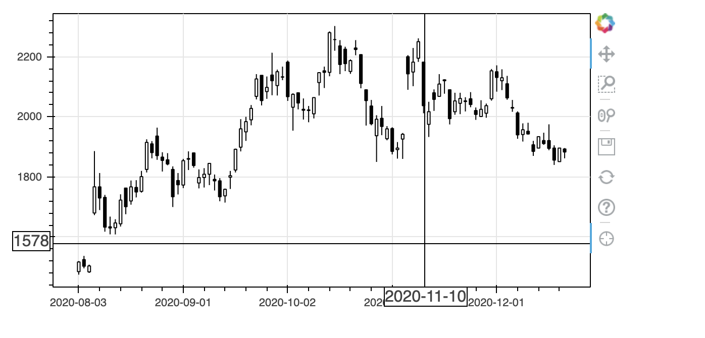

続いて次のような2軸のグラフの場合に、右側に値を表示することを考えます。


```Python
from bokeh.plotting import figure, show, output_notebook
from bokeh.models import ColumnDataSource, Range1d, LinearAxis, NumeralTickFormatter
import pandas as pd

def candlestickWithVolume(df, plot_width=600, plot_height=300, x_range=None):
    df = df.reset_index()
    source = ColumnDataSource(df)
    inc = ColumnDataSource(df[df.Close >= df.Open])
    dec = ColumnDataSource(df[df.Open > df.Close])
    w = (df.index[1] - df.index[0]) / 2  # X軸の1メモリの半分

    # ローソク足を作成
    fig = figure(plot_width=plot_width, plot_height=plot_height, x_range=x_range, y_range=(0, max(df.High)),
                 y_axis_location='right', toolbar_location=None)
    fig.segment('index', 'High', 'index', 'Low', source=source, color="black")
    fig.vbar('index', w, 'Open', 'Close', source=inc, line_color="black", fill_color="white")
    fig.vbar('index', w, 'Open', 'Close', source=dec, line_color="black", fill_color="black")
    fig.xaxis.major_label_overrides = {
        i: pd.to_datetime(date).strftime('%Y-%m-%d') for i, date in enumerate(source.data['Date'])
    }
    fig.xaxis.bounds = (0, df.index[-1]) # X軸の範囲を明示的に指定
    fig.yaxis.axis_label = '価格'
    fig.outline_line_color = 'black'

    # 出来高をローソク足と同じグラフに表示
    fig.extra_y_ranges = {"volume": Range1d(start=0, end=max(df.Volume) * 2)}
    fig.add_layout(LinearAxis(y_range_name="volume", axis_label="出来高"), 'left')
    fig.vbar('index', w, 'Volume', source=inc, line_color="black", fill_color="white", y_range_name="volume")
    fig.vbar('index', w, 'Volume', source=dec, line_color="black", fill_color="black", y_range_name="volume")
    fig.yaxis.formatter = NumeralTickFormatter(format="0,0")

    return fig

fig = candlestickWithVolume(df['2020-8-1':])

output_notebook()
show(fig)
```

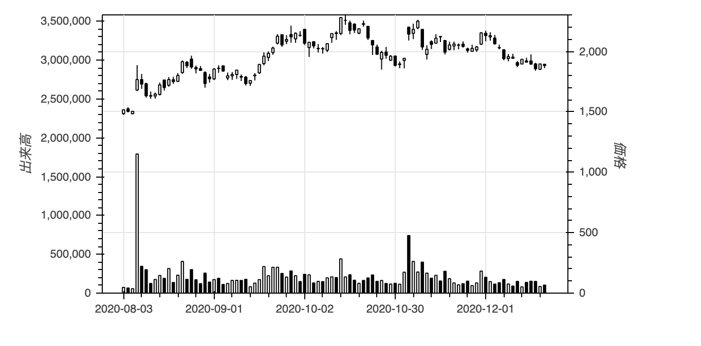

右側にラベルを表示する時に困るのはそのx座標をどうするかです。左側なら0と指定しておけばよいですが、右側では図の横幅が必要となります。しかも、固定値ではなく図のサイズに応じて。いろいろ探ってみたところ、JavaSriptでのcb_objに'origin'という属性があり、ここから図のDOMオブジェクトにアクセスできることがわかりました。

次に困ったのは出来高のy座標です。cb_obj['y']はy_rangeの値で、extra_y_rangeの値にアクセスする方法がありません。そこで、予めy軸上での価格と出来高の比率を求め、それを渡して価格から出来高を求めることで解決しました。


```Python
from bokeh.plotting import figure, show, output_notebook
from bokeh.models import ColumnDataSource, Range1d, LinearAxis, NumeralTickFormatter
from bokeh.models import CustomJS, CrosshairTool
from bokeh.models.annotations import Label
from bokeh import events
import pandas as pd

def display_event(source, xlabel, vlabel, plabel, pv_ratio):
    return CustomJS(args=dict(source=source, xlabel=xlabel, vlabel=vlabel, plabel=plabel, pv_ratio=pv_ratio), code="""
        try {
            xlabel.visible = true
            var date = new Date(source.data['Date'][Number(cb_obj['x']).toFixed(0)])
            xlabel.text = date.toISOString().substr(0, 10)
            xlabel.x = cb_obj['x']
            xlabel.y = 0
        } catch(e) {
            xlabel.visible = false
        }
        vlabel.visible = true
        vlabel.x = 0
        vlabel.y = cb_obj['y']
        vlabel.text = Math.round(cb_obj['y'] * pv_ratio).toLocaleString()
        plabel.visible = true
        plabel.x = cb_obj['origin'].inner_width
        plabel.y = cb_obj['y']
        plabel.text = Math.round(cb_obj['y']).toLocaleString()
    """)

def leave_event(xlabel, vlabel, plabel):
    return CustomJS(args=dict(xlabel=xlabel, vlabel=vlabel, plabel=plabel), code="""
        xlabel.visible = false
        vlabel.visible = false
        plabel.visible = false
    """)

target = df['2020-8-1':]
fig = candlestickWithVolume(target)
xlabel = Label(y_units='screen', x_offset=-40, y_offset=-20, render_mode='css',
               border_line_color='black', background_fill_color='white', visible=False)
vlabel = Label(x_units='screen', x_offset=-76, y_offset=-8, render_mode='css',
               border_line_color='black', background_fill_color='white', visible=False)
plabel = Label(x_units='screen', x_offset=4, y_offset=-8, render_mode='css',
               border_line_color='black', background_fill_color='white', visible=False)
fig.add_layout(xlabel)
fig.add_layout(vlabel)
fig.add_layout(plabel)
pv_ratio = max(target.Volume) * 2 / max(target.High)
fig.add_tools(CrosshairTool())
fig.js_on_event(events.MouseMove,
                display_event(source=ColumnDataSource(target), xlabel=xlabel, vlabel=vlabel, plabel=plabel, pv_ratio=pv_ratio))
fig.js_on_event(events.MouseLeave, leave_event(xlabel=xlabel, vlabel=vlabel, plabel=plabel))
output_notebook()
show(fig)
```

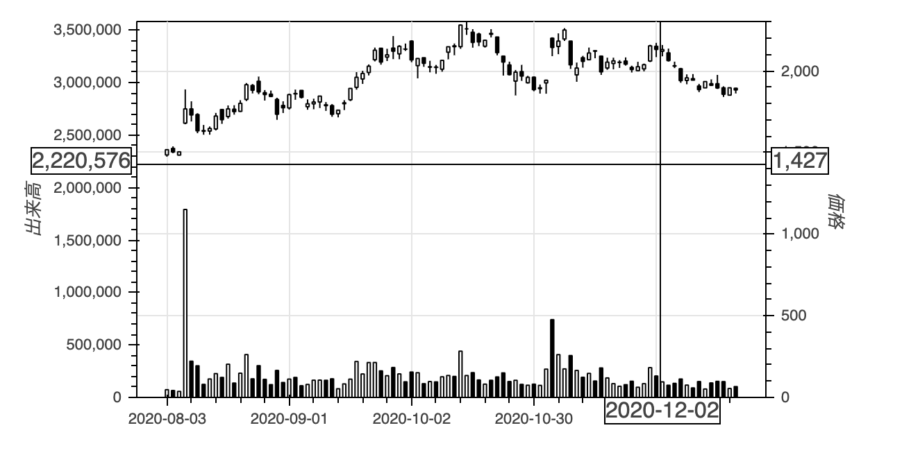

最後に[以前の記事](https://qiita.com/saliton/items/6249d92f266ef435a5f0)で作成した範囲指定付きローソク足に適用します。


```Python
from bokeh.models import RangeTool
from bokeh.layouts import column
from bokeh.plotting import output_file

df_reset = df.reset_index()
fig = candlestickWithVolume(df, x_range=(df_reset.index[-100], df_reset.index[-1]))
source = ColumnDataSource(df_reset)
# # 図のタイトルを設定
fig.title.text = 'Soliton'
fig.title.align = 'center'
fig.title.text_font_size = '24pt'
# ラベルを準備
xlabel = Label(y_units='screen', x_offset=-40, y_offset=-20, render_mode='css',
               border_line_color='black', background_fill_color='white', visible=False)
vlabel = Label(x_units='screen', x_offset=-76, y_offset=-8, render_mode='css',
               border_line_color='black', background_fill_color='white', visible=False)
plabel = Label(x_units='screen', x_offset=4, y_offset=-8, render_mode='css',
               border_line_color='black', background_fill_color='white', visible=False)
# ラベルを配置
fig.add_layout(xlabel)
fig.add_layout(vlabel)
fig.add_layout(plabel)
# 出来高と価格の比を計算
pv_ratio = max(df.Volume) * 2 / max(df.High)
# 十字表示を設定
fig.add_tools(CrosshairTool())
# イベントを設定
fig.js_on_event(events.MouseMove,
                display_event(source=source, xlabel=xlabel, vlabel=vlabel, plabel=plabel, pv_ratio=pv_ratio))
fig.js_on_event(events.MouseLeave, leave_event(xlabel=xlabel, vlabel=vlabel, plabel=plabel))

# 範囲ツールを設定
range_tool = RangeTool(x_range=fig.x_range)
range_tool.overlay.fill_color = "navy"
range_tool.overlay.fill_alpha = 0.2

# 範囲選択用の図を作成
select = figure(plot_height=130, y_range=fig.y_range, y_axis_location='right',
                tools="", toolbar_location=None, background_fill_color="#efefef")
select.line('index', 'Close', source=source)  # 範囲選択用の図には終値を表示
select.extra_y_ranges = {"volume": Range1d(start=0, end=max(df.Volume) * 2)}
select.add_layout(LinearAxis(y_range_name="volume"), 'left')
select.vbar('index', 0.5, 'Volume', source=source, line_color="black", fill_color="black", y_range_name="volume")
select.yaxis.formatter = NumeralTickFormatter(format="0,0")
select.xaxis.major_label_overrides = {  # X軸の表示の対応を指定
    i: pd.to_datetime(date).strftime('%Y-%m-%d') for i, date in enumerate(df.reset_index()['Date'])
}
select.add_tools(range_tool)

output_notebook()  # 出力先をノートブックに設定
output_file('soliton.html') # ファイルにも出力
show(column(fig, select, sizing_mode='stretch_width'))  # 図を表示
```

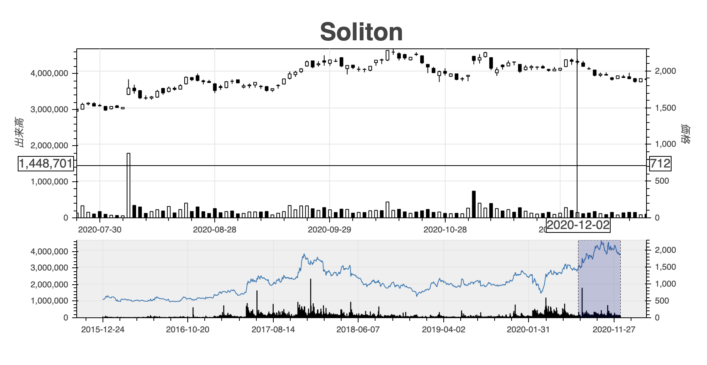

以上です。
